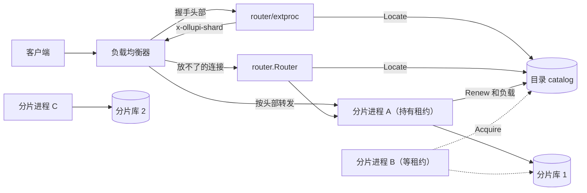

# 分片与租约

一个 SQLite 库是一个分片（shard）。分片上的用户共用它的表，按用户隔离。引擎本身不知道分片：`shard` 包把一个进程作为某个分片运行，它在部署的目录（catalog）里持有这个分片的租约（lease），同一时间只有一个进程运行一个分片；持有者退出后，等着租约的备用进程接管，从上次停下的地方继续。分片数量决定容量。客户端只连一个地址，不知道自己在哪个分片：负载均衡器的回调或路由器查目录，把连接送到用户所在的分片。

```mermaid
flowchart LR
  C["客户端"] --> LB["负载均衡器"]
  LB -->|"握手头部"| X["router/extproc"]
  X -->|"x-ollupi-shard"| LB
  LB -->|"按头部转发"| P1
  LB -->|"放不了的连接"| R["router.Router"]
  R --> P1
  X -->|"Locate"| K[("目录 catalog")]
  R -->|"Locate"| K
  P1["分片进程 A（持有租约）"] -->|"Renew 和负载"| K
  P2["分片进程 B（等租约）"] -.->|"Acquire"| K
  P1 --> D1[("分片库 1")]
  P2 -.-> D1
  P3["分片进程 C"] --> D2[("分片库 2")]
```

## 为什么这样设计

- **用户共用分片的表。** 工作区、会话、记忆、设置带用户，日志、定时任务、待办经会话或用户列归属。分片上所有用户的会话由同一个调度器、同一组槽位运行。见[设计决策 10](/zh/reference/decisions#_10-单库即分片与租约)。
- **引擎不知道分片。** 宿主、调度、网关都不涉及租约；`shard.Member` 包在外面，拿到租约才运行引擎，失去租约就取消它。不作为分片运行时不调用 `Fence`，网关也不设 `Admit`。
- **租约和地址在同一处。** 租约记在目录里分片的那一行，和持有者的地址放在一起，不会对不上。接管就是重启恢复，因为调度状态全在库里，见[崩溃恢复](/zh/engine/persistence#崩溃恢复)。
- **epoch 挡住卡住的旧持有者。** 每次占有都得到一个更大的 epoch，分片库记下它，每次写入都核对，旧持有者写不进新持有者的库。
- **租约按目录的时钟判定，持有者提前放弃。** 到期由目录算；持有者从请求发出前计时，提前十分之一放弃，总在别人能接手之前停下，即使两边时钟有偏差。
- **路由无状态，分片自己再查一次。** 回调和路由器只认证、查目录、转发，可运行任意多个；分片在第一次服务某用户前确认该用户归自己。
- **放置看负载，两选一。** 新用户随机抽两个接收新用户的分片，放到负载低的那个：新分片能分到一份，但不会吸走所有新用户。

代价：容量靠分片数堆，单个分片仍是一个 SQLite 文件和一条连接；用户不能跨分片迁移；进程崩溃没释放租约时，接管要等租约过期；备用进程要能打开同一个库和附件目录；目录是所有分片和路由共用的依赖；分片只在同一台机器上测过，跨机器的扩展没有测。

::: info 演进
早期一个库只属于一个使用者；现在一个库是一个分片，按用户隔离。租约曾经记在分片库里、由引擎（`agent.Config.Lease`）自己续约，地址由宿主发布；现在记在目录里，由 `shard.Member` 持有，分片库只记 epoch。
:::

## 多用户隔离

用户隔离在同一张表里完成，不是一人一个库。

### 数据归属

工作区、会话、环境、MCP 服务器、记忆、待办自带 `user_id`，设置和 `memory_state` 以 `user_id` 为主键；`entries`、`turns`、`items`、`responses`、`cron_jobs`、`tasks` 经 `thread_id` 归属，`tasks` 也自带 `user_id`。`usage` 自带 `user_id` 和 `workspace_id`，没有外键：会话删掉后行还在，行的 id 是 `<会话>:<seq>`。唯一约束与表结构见[持久化](/zh/engine/persistence#表和关系)。

### 入口检查

调用方拥有什么，在 `app` 的入口检查。不属于这个用户的东西一律当作不存在，返回 `store.ErrNotFound`，到协议层是 `notFound`。

| 检查 | 用在 |
|---|---|
| `thread(r, user, id)`（`app/app.go`） | 按用户读会话；`th.User != user` 时返回包了 `store.ErrNotFound` 的错误 |
| `Reader.Workspace(user, id)`、`Reader.Environment(user, id)` | 按用户读工作区和执行环境 |
| `Reader.Threads(user, ...)`、`Reader.Search(user, ...)`、`Reader.CronJobs(user, ...)`、`Reader.Memories(user, ...)`、`Reader.Settings(user)`、`Reader.MCPServers(user)` | 列表、搜索、记忆、设置、MCP 服务器都带用户条件 |

发消息、插话、中断、改名、归档、删除、改权限、定时任务、待办都先经 `thread` 拿会话。`read_tool_output` 只读调用者所在会话的视图，模型读不到别的会话的输出。定时任务的轮次没有调用方，在所属会话里运行，按会话主人算。

### 事件和连接

网关的每条连接在 `initialize` 之后用 `Feed.Subscribe(user, ...)` 订阅自己用户的事件，事件只发给本人；没有用户的事件不发给任何人。一个用户最多同时有四条连接（`wshub.Options.PerKey` 默认 4），每条都收到这个用户的全部事件；第五条建立时最早的一条被顶掉，关闭码是 `StatusReplaced`（4000）。连接默认最长 `MaxAge` 20 小时，实际在 20 小时减去最多四分之一之间随机到点，以 `StatusGoingAway` 关闭。关闭码与重连见[接入客户端](/zh/integrate/client)。

心跳每 `PingEvery`（默认 30 秒）发一次 `ws.Ping`，最多等 `PongWithin`（15 秒）。ping 失败不一定断开：只有 `jsonrpc.Conn.Silent(sent)` 为真时 `wshub` 才 `CloseNow()`，而 `Silent` 只在读协程从发 ping 之前起就停在 `ws.Read` 上时为真。读协程等 pace 令牌（`messagesPerSecond` 50、`messageBurst` 200）或在满 inbox（`maxInboxMessages` 64、`maxInboxBytes` 8 MiB）上阻塞时不算沉默——这是服务端放慢读取，不是对端消失，连接不会被心跳断掉。

一个用户第一次连到这个进程时，网关先做分片这一侧的校验，再调用 `EnsureUser`，建 `users`、`settings` 和这台机器的执行环境；之后这个进程记住这个用户，重连不再写库。

调度不区分用户：所有用户的可运行会话在同一个队列里，按相同顺序取，只受单用户槽位限额约束。

## 分片

`sqlite.Open(home)` 打开的库就是一个分片。分片之间不共享数据，用户的会话、记忆和附件都留在自己的分片。

所有分片和路由共用一个目录，接口是 `catalog.Catalog`：

| 方法 | 行为 |
|---|---|
| `Acquire(shard, owner, address, accepting, ttl)` | 没有进程持有或租约已过期时占有，写上持有者地址和是否接收新用户，返回新的 epoch；有人持有时 `held` 为假 |
| `Renew(shard, owner, epoch, ttl, load)` | 续约并报告负载；持有者或 epoch 对不上时返回 `catalog.ErrLeaseLost` |
| `Release(shard, owner, epoch)` | 立即放弃租约，只在持有者和 epoch 都对上时生效 |
| `Locate(user)` | 返回用户的分片和持有者地址；新用户在这时放置；没有进程持有时地址为空；没有能接收的分片时返回 `catalog.ErrNoShard` |
| `ShardOf(user)` | 只查用户的分片，不放置；没放置时返回空 |
| `Place(user, shard)` | 运维指定用户的分片，比如单独给一个客户；用户已在别的分片时报错 |

`catalog.SQL` 是唯一的实现，用 `catalog.OpenSQL(path)` 打开一个独立的 SQLite 文件，表结构按自己的编号 migration（`catalog/migrations/`）升级。需要目录比任何一台机器活得久的部署，可以在协调服务（比如 etcd）或独立于分片的数据库上实现这个接口。

| 表 | 字段 | 说明 |
|---|---|---|
| `shards` | `id` | 分片 ID |
| | `address` | 当前持有者接受连接的地址 |
| | `accepting` | 是否接收新用户；留给单个客户的分片设为否 |
| | `load` | 持有者最近一次报告的负载 |
| | `owner` | 持有进程的 UUID；空表示没有进程持有 |
| | `epoch` | 最近一次占有的 epoch |
| | `expires_at` | 租约到期时间，Unix 毫秒，按目录的时钟 |
| `placements` | `user_id` | 用户，主键 |
| | `shard_id` | 所在分片，带索引 `idx_placements_shard_id` |

`catalog.SQL` 的每个事务一开始就拿写锁（见 [SQLite 配置](/zh/engine/persistence#sqlite-配置)），所以多个分片和路由进程可以同时打开、同时写同一个目录文件，同一个新用户不会被放两次。引擎不搬迁用户：用户一旦在分片上有了数据就留在那里，`Place` 必须在用户有任何数据之前调用。

### 放置新用户

`Locate` 遇到没放置过的用户时，在同一个事务里放置：

1. 取出所有 `accepting` 的分片，连同各自的负载和已放置的用户数。
2. 只有一个时就放到它；多于一个时随机抽两个不同的。
3. 负载低的胜出；负载相同时用户少的胜出；再相同取先抽到的。
4. 写入 `placements`。

负载由各分片的持有者报告，见[负载上报](#负载上报)。测试里九个各有 50 个用户的空闲分片加上一个新分片，新分片分到 100 个新用户中的一部分，但少于 50 个（`TestAShardJustAddedTakesASharePerhapsLargerButNotAll`）。

## 分片租约

`shard.Member` 把一个进程作为一个分片运行：

| 字段 | 含义 |
|---|---|
| `ID` | 分片 ID |
| `Address` | 这个进程接受连接的地址，占有时写进目录 |
| `Accepting` | 是否接收新用户 |
| `Catalog` | 目录 |
| `TTL` | 租约时长，必须大于 0，没有默认值 |
| `Load` | 报告负载的函数，可空；度量由部署选择 |

`bench` 的崩溃实验用 `-lease 1500ms`。

### 租约行

租约就是目录里分片那一行的 `owner`、`epoch`、`expires_at`。`catalog.SQL` 的占有是一条 `INSERT … ON CONFLICT(id) DO UPDATE`，只在 `shards.owner = ''` 或 `shards.expires_at <= <now>` 时生效，更新时把 `epoch` 加一，第一次是 1。`<now>` 是目录自己的当前时间（由 `julianday('now')` 换算成 Unix 毫秒），所以到期只按目录的时钟判定，和发起请求的进程的时钟无关。续约只在 `owner` 和 `epoch` 都对上时更新 `expires_at` 和 `load`；放弃把 `owner` 清空、`expires_at` 置 0。

### 时间参数

设租约时长为 T：

| 动作 | 间隔或期限 |
|---|---|
| 等待方尝试占有 | 每 T/3 一次 |
| 持有方续约 | 每 T/3 一次 |
| 持有方认为自己还持有到 | 最近一次成功的占有或续约**发出之前**的时刻加 0.9T |
| 每次访问目录的超时 | 10 秒 |
| 进程被杀后的接管延迟 | 最多约 T + T/3（租约到期，加一次尝试的间隔） |
| 进程正常退出后的接管延迟 | 最多约 T/3（租约已放弃，只等一次尝试） |

目录把租约延到"它收到请求时 + T"，而持有者从请求发出之前算起、只算到 0.9T，所以持有者认为的期限总早于目录判定的到期，差出的余量是 T/10 加上请求在路上的时间。这个余量覆盖两边时钟走速的差异，而不依赖两边时钟对齐。

### 启动和接管

`Member.Run(ctx, st, serve)` 先生成这个进程的 `owner`（UUID），循环调用 `Acquire`，没拿到就等 T/3 再试，直到拿到或 ctx 结束；目录出错也只是下一轮再试。拿到后 `st.Fence(epoch)` 把 epoch 记进分片的库（见[围栏](#围栏)），库里已有更大的 epoch 时返回 `store.ErrShardLost`，`Run` 失败。然后起续约的 goroutine，用它持有的 ctx 调用 `serve`，宿主在 `serve` 里运行引擎（`host.Run`）和网关；`serve` 返回后放弃租约（带 10 秒超时，不受外层 ctx 取消影响）。

`serve` 里的流程和普通重启完全相同：调度器从库里读出可运行的会话，每次运行先关掉上一个进程切断的调用，接着往下走；接管不需要专门的逻辑，见[崩溃恢复](/zh/engine/persistence#崩溃恢复)。`host.New` 打开 store 在 `Member.Run` 之前，所以备用进程启动时就打开了分片的库，只是不运行引擎、不服务连接。

### 续约和失去租约

续约的 goroutine 每 T/3 调用一次 `Renew`，同时带上 `Load()` 的结果：

| 结果 | 处理 |
|---|---|
| 成功 | 把期限更新为这次请求发出前的时刻加 0.9T |
| 失败（包括 `ErrLeaseLost`），还没到期限 | 下一轮再试 |
| 失败，已过期限 | 失去租约 |

失去租约时，续约的 goroutine 以 `store.ErrShardLost` 为原因取消 `serve` 的 ctx：调度器停下，所有运行的 ctx 结束，进行中的模型调用和工具随之取消，网关停止服务。`Run` 返回包了 `store.ErrShardLost` 的错误。这些会话留在库里原样的状态，由新的持有者接着运行。

### 围栏

进程可能卡得比租约还久：既没续约，也还不知道自己失去了租约，而新持有者已经开始工作。`Store.Fence(epoch)` 写分片库的 `shard_epoch`，只在库里的值不大于这个 epoch 时生效，否则返回 `store.ErrShardLost`；之后每个 `Store.Update` 在事务开始时读 `shard_epoch`，不等于自己的 epoch 就返回 `store.ErrShardLost`，事务不执行。事务一开始就拿写锁，核对和写入之间别的进程插不进来。

所有写入都走 `Update`，所以旧持有者在新持有者 `Fence` 之后的每一次写入都会被拒绝。被拒绝的写入里包括调度器想把出错的轮次记为失败的那一次，于是调度器带着错误退出，旧进程的引擎停下。`Read` 不核对 epoch；没有调用过 `Fence` 的 store（不作为分片运行时）不做这项检查。

旧进程里已经在沙箱中执行的工具，要等它的 ctx 被取消才停；在那之前工具的副作用照常发生，结果写不进库。新持有者看到的是一个已开始、没有结果的调用，记为被切断。

### 负载上报

`Member.Load` 返回分片当前的负载，续约时一起写进目录，供[放置新用户](#放置新用户)比较。度量由部署选择，引擎提供几种现成的计数：

| 度量 | 来源 |
|---|---|
| 最近活跃的用户 | `Reader.Active(since)`：有会话在 `since` 之后更新过的用户数 |
| 进行中的会话 | `Reader.Busy()`：状态不是 `idle` 的会话数 |
| 连接数 | `gateway.Server.Connections()`：当前由 `wshub` 持有的连接数 |

`Load` 为空时报告 0；`Load` 返回错误时这一次也报告 0。负载只在续约时写，刚占有分片时目录里还是上一个持有者报告的值。

## 路由器

客户端只连一个地址。认证和查分片是 `router.Locator`：用 `auth.Authenticate` 认出用户，再 `catalog.Locate` 找到分片和持有者的地址，整个查找限时 10 秒，不缓存。它有两个用法：负载均衡器的回调，和路由器本身。

`router.Router` 实现了 `http.Handler`，不保存状态，可以运行任意多个：

| 步骤 | 失败时 |
|---|---|
| 认出用户 | 令牌不认识：401 `invalid or missing gateway token` |
| 查分片，新用户在此时放置 | 认证服务出错或目录出错：503 `no shard can take this user now` |
| 分片没有持有者 | 503 `no process holds the user's shard now; try again` |
| 解析地址 | 503 `the user's shard cannot be reached now` |
| `httputil.ReverseProxy` 转发，含 WebSocket 升级；等分片回应头部最多 30 秒 | 503 `the user's shard cannot be reached now; try again` |

路由器不解析 JSON-RPC，只转发连接。转发时请求的 `Host` 换成目标地址的主机，所以分片网关的 `AllowedHosts` 要包含它。分片换手时，连在旧进程上的 WebSocket 断开，客户端重连，再次经路由器转到新地址；新持有者占有之前，客户端看到 503 并重试。重连见[接入客户端](/zh/integrate/client)。

### 负载均衡器回调

能通过 Envoy 外部处理协议（ext_proc）回调的负载均衡器，比如 Google Cloud 应用负载均衡器的路由扩展，用 `router/extproc` 放置连接：收到握手的请求头时，`extproc.Callout` 用同一个 `Locator` 找到用户的分片，设置 `x-ollupi-shard` 头（`extproc.ShardHeader`），覆盖客户端自己带来的同名头；负载均衡器按这个头路由并自己持有连接，认证或查找失败时删掉这个头，连接落到默认后端的 `router.Router`，由它回 401 或 503。其余阶段原样放行。

没有这样的负载均衡器时，全部连接都由 `router.Router` 转发。

### 分片这一侧的校验

路由的结果可能过时，或者连接绕过了路由。`gateway.Options.Admit` 设为 `shard.Member.Admit` 时，网关在第一次服务一个用户之前调用它：`Admit` 用 `ShardOf` 查这个用户的分片，不是自己（包括还没放置）就拒绝。网关回 503，带 1 到 `Connections.RetryWithin`（默认 5）秒之间随机的 `Retry-After`，正文 `this user is not served here now; try again`。`Admit` 只查不放：新用户的放置只发生在路由的 `Locate` 里；一个用户在这个进程里通过一次之后，同一进程不再查它。不设 `Admit` 时网关服务所有认证通过的用户。

### 健康检查

`/healthz`（`auth.HealthPath`）不要令牌，分片网关和路由器都直接回 200。分片进程只在 `serve` 里运行网关，也就是只在持有租约时服务；负载均衡器的健康检查因此只找得到持有者，把这个分片的连接送到它那里。

## 令牌认证

Ollupi 不做登录。登录在它之前完成，`auth.Authenticate(ctx, token)` 只回答"这是谁的令牌"。`auth.TokenOf` 先读 `Authorization: Bearer <token>`，再读 WebSocket 子协议 `["ollupi.token", token]`；令牌不进 URL，因为访问日志会记录 URL。认证服务暂时不可用时网关回 503 并带 `Retry-After`，路由器回 503 `no shard can take this user now`。

网关的 `Options.Token` 是单用户网关的令牌，属于 `default` 用户；多用户时用 `Options.Authenticate` 取代它，两者都没有时 `gateway.NewServer` 报错。网关在令牌之前还校验 `Host`（`localhost`、`127.0.0.1`、`::1`、`AllowedHosts`）和 `Origin`（`localhost:*`、`127.0.0.1:*`、`[::1]:*`、`AllowedOrigins`），不在其中回 403。握手和子协议协商见[网关协议](/zh/integrate/protocol#认证)。

## 单用户槽位限额

`host.Config.UserSlots` 防止一个用户的会话占满分片的槽位，默认等于 `Slots`（32），即不限。调度器取可运行的会话时排除已到上限的用户，启动前再查一次；超额的会话留在可运行状态，不失败，这个用户的槽位释放后接着取。子 agent 会话和父会话是同一个用户，算在同一个限额里。调度的细节见[执行模型](/zh/engine/execution)。

后台调用有另一个调度器：`TaskSlots`（默认 32）、`UserTaskSlots`（默认 4）、`TaskLimit`（默认 1 小时）。后台调用怎样变成任务，见[持久化](/zh/engine/persistence#后台调用)。

## 每用户资源

`host.Config` 有两个按用户取资源的钩子：`ClientFor(user, connection)` 返回这个用户调用这条连接时用的模型客户端（记忆提取也用它），没配时共用 `Connections`；`Boxes(user)` 返回这个用户的沙箱（命令、文件和本地 MCP 服务器都经它访问），必填。模型并发名额在客户端内部，所以 `ClientFor` 应该每次返回同一个客户端，否则限制不生效；窗口预算和模型列表仍从共享的 `Connections` 里读，所以它始终要配（见[模型](/zh/engine/models)）。`ClientFor` 返回错误时只有这一轮失败。

每个用户的 MCP 服务器存在 `mcp_servers` 里，由 `mcp.Users` 按用户连接；用户改了服务器后，下次取工具时重新连接，见[技能与 MCP](/zh/engine/skills-mcp)。沙箱见[沙箱](/zh/engine/sandbox)。

## 边界与已知问题

- **租约接管只在一台机器上测过。** `bench crash -lease 1500ms` 在负载下 kill 8 次，备用进程接管 p50 1.3 s，没有轮次丢失、没有工具执行两次（[恢复](/zh/benchmarks/#恢复)）；进程分在几台机器上时没有测。
- **多分片的吞吐在一台机器上测过，已经碰到上限。** 4096 个会话、64 个用户、每轮三次模拟模型调用（5 s ± 2 s），每个分片是一个 `bench serve` 进程、各有自己的库，客户端经路由器走协议，全部进程在同一台 M1 上：每秒完成 89.0（1 分片直连）、84.9（1 分片经路由器）、116.3（2 分片）、144.4（4 分片）个轮次，2 分片是 1 分片的 1.37 倍、4 分片 1.70 倍。4 分片时全部进程合计 5.3 核，机器先到上限；路由器本身 0.04 到 0.11 核，代价测不出（[分片](/zh/benchmarks/#分片)）。跨机器、或继续加数量时吞吐怎样没有测。
- **吵闹邻居要靠 `UserSlots`。** `UserSlots` 默认不限：一个让 1024 个会话忙着的用户会占满 512 个槽位，其他用户的轮次 p50 等 206 s；设为 64 后只等 8 ms（[多用户](/zh/benchmarks/#多用户)）。不配 `ClientFor` 时所有用户共用连接上的模型并发名额。
- **旧持有者的工具停得晚。** epoch 挡住的是写库；旧进程槽位里正在执行的工具要等它的 ctx 被取消才停，在那之前沙箱里的副作用照常发生，新持有者把这些调用记为被切断。
- **目录是共同依赖。** 路由对每条连接都查 `Locate`，分片的 `Admit` 也查目录，查不到时都回 503，客户端按 `Retry-After` 重试。持有者连续续约失败超过期限就放弃分片，所以目录长时间不可用时，所有分片都会停下。
- **放置不看分片有没有持有者。** 新用户可能被放到一个 `accepting` 但暂时没有进程持有的分片上，在有进程占有它之前，这个用户的连接都回 503。
- **负载出错按 0 报。** `Load` 返回错误时报告 0，这个分片在放置时会显得空闲。
- **migration 早于占有租约。** 它在 `sqlite.Open` 里执行，而 `Member.Run` 在之后。版本更新的备用进程一启动，就会在持有者还在运行时升级表结构，代码里没有挡住这种情况。
- **用户不能迁移。** 用户有了数据就留在原分片，`Place` 必须在用户有任何数据之前调用。

## 代码位置

| 仓库 | 路径 | 职责 |
|---|---|---|
| ollupi | `shard/shard.go` | `Member`：占有、续约、放弃租约，`Admit` |
| ollupi | `catalog/catalog.go` | `Catalog` 接口、`ErrNoShard`、`ErrLeaseLost` |
| ollupi | `catalog/sql.go` | `catalog.SQL`：租约、放置、两选一 |
| ollupi | `store/sqlite/sqlite.go` | `Fence` 和每次写入的 epoch 核对 |
| ollupi | `router/router.go` | `Locator`、`Router` |
| ollupi | `router/extproc/extproc.go` | 负载均衡器回调，`x-ollupi-shard` |
| ollupi | `auth/auth.go` | `Authenticate`、`TokenOf`、`HealthPath` |
| ollupi | `gateway/serve.go`、`gateway/auth.go` | `Options`、`DefaultConnections`、Host 和令牌校验 |
| ollupi | `gateway/server.go` | `Admit` 的调用、`Connections`、`/healthz`、订阅 |
| ollupi | `pkg/wshub/wshub.go` | 每用户连接上限、`StatusReplaced`、`MaxAge`、心跳 |
| ollupi | `pkg/jsonrpc/jsonrpc.go` | `Silent`、pace 与 inbox 上限 |
| ollupi | `app/app.go` | 按用户读会话的 `thread` |
| ollupi | `host/host.go`、`host/models.go` | `ClientFor`、`Boxes`、`UserSlots`、任务槽位的装配 |
| ollupi | `bench/shards.go` | 1、2、4 分片的测量 |
| ollupi | `bench/crash.go` | 用 `shard.Member` 运行的崩溃和接管实验 |
